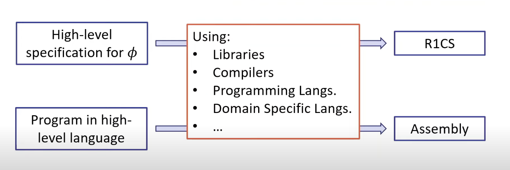

# Circom

a HDL languages to write circuit

## How to Wire Circuits in Circom
1. Create variables for every intermediate wire.
2. Write equations to constrain the relationships between the wires.

for example 

```circom 
pragma circom 2.0.0;

/*This circuit template checks that c is the product of a and b.*/  

template Multiplier2 () {  

   // Declaration of signals.  
   signal input a;  
   signal input b;  
   signal output c;  

   // Constraints.  
   c <== a * b;  
}

```


