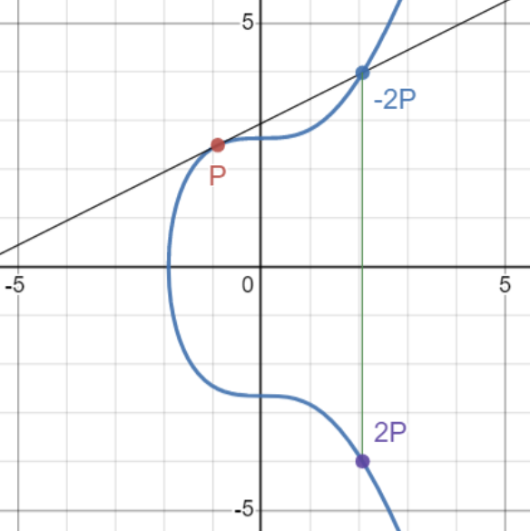
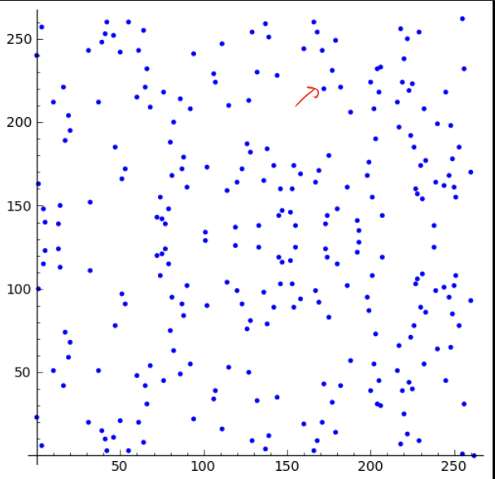

# Ecliptic curve

Why do you need to understand this?
 - zk-SNARKs operate on fields of large numbers within elliptic curves (BN254).

> p = 21888242871839275222246405745257275088548364400416034343698204186575808495617

Because for security, any input or witness should not be directly revealed, we utilize BN254, an elliptic curve, to optimize security.

This is the representation of negative one (-1) in Circom.

```math 
p = 21888242871839275222246405745257275088548364400416034343698204186575808495617.

# 1 - 2 = -1
(1 - 2) % p

# 21888242871839275222246405745257275088548364400416034343698204186575808495616

```
Remember that this representation is used for security purposes in Circom.

But why modulo p?
- To ensure that all values within the circuit remain within a specific range, making it more efficient to reason about and prove their validity in zk-SNARKs.


Okay, no worries if you don't understand yet.

ECDH has multiple ratios (methods to create pairings)
    - Group Operation
    - Point Dobublig
    - Adding Vertical point
    - Scalar Multiplication 👈 I'll explain this.

Let's say we have...
-   P is a point on curve 
-   k is a integer 𝕫
-   Q(P * k time) ----> this is our final destination. <br>  
>  Q = P+P+...+P } k times

Okay, please take a look at this graph. <br>
 <br>

then look into this <br>


So, if I ask you what parameter or what is the K value to reach the red point, the answer might be mind-blowing! 🤯


Here is a benchmark of each type of pairing-friendly library. 👉 <https://hackmd.io/@gnark/eccbench#BN254>
