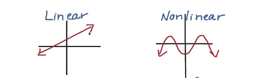
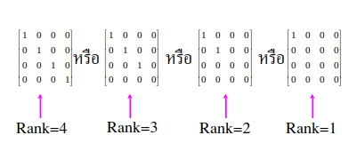

# Basic Math for Zero-Knowledge

There is a lot of mathematics used in zero-knowledge technology, similar to cryptography.

However, in this section, we will focus on learning the mathematics necessary to understand how to write circuits and how these circuits function mathematically.

There are two sections of mathematics that you should be familiar with before diving into the code section.

## Non-linear Equation

- Why do we need to know this?
    - When we write circuits in Circom, they must be expressed in terms of quadratic equations. These constraints are essential for the efficient generation of zero-knowledge proofs.
- Why must circuits in Circom be expressed in terms of quadratic equations?
    - Imagine if the minimum complexity of each computation were x ** 4. Computation time would skyrocket, leading to increased complexity and significantly longer processing times. This is why Circom restricts computations to a maximum of x ** 2 – it prioritizes efficient proof generation.
#### Linear vs Non-linear

## Matrix

#### Rank of matrix

- Why do we need to know this?
    - After wiring an arithmetic circuit, it will be compressed and computations will be expressed in terms of ***R1CS (Rank-1 Constraint System)***, which heavily involves matrix operations. 1  

Why is it called "Rank-1"?
    - The rank of a matrix is used to evaluate how many independent equations can be derived from it.
    - Therefore, Rank-1 constraints are designed to efficiently compute and process only one independent equation per matrix. Imagine having 10 ranks in a matrix; the computational complexity would significantly increase.

#### solving equation problem with matrix
A common technique to determine the rank of a matrix and subsequently solve systems of equations is to use Gaussian elimination.
