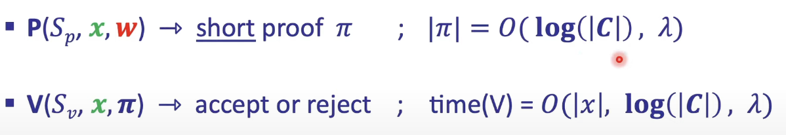

# Negligible function
Know as crptography method to imporve security of our Proof

Definition (Please visit this video first) 👉 <https://www.youtube.com/watch?v=l5A3oEG-XKk&list=PLAj2bGZ0eFtICkway8SJBrJBQ76VinWzB&index=2>

imagine attacker try to make something like Brute force with unbound computation to find our Poof in field 𝔽

so what happend ?

brute foce will not work cuz untill they will find correct N it take so long long time, or that mean they are struct to Polynominal time while Proof already verify in Logaritmic time.

then attacker will be use guess method to chosen the right one it call Poly-bounded adversary !!

this is where ***Negligible function*** come to play 

Polynominal Algirthm have n as secret param, that mean if attacker need to find the right one they will struct in Polynominal time exactly but now they use method to random N that have potential to be the right one. 

what negligible function do ? 
 - reduce probability to find right one in poly time !!
 cuz it think about 1 / p(λ)

that why proof size is depend on λ(secret lamda param)

