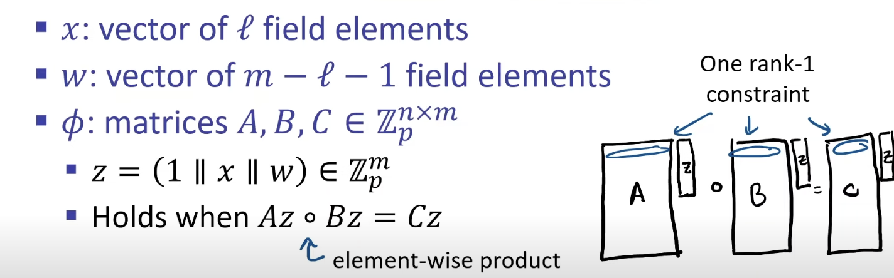

# Rank 1 Constrain Systems 

Now, after compiling your circuit, you obtain a ```file.r1cs``` file. This indicates that the part where matrix operations come into play has begun.

> This is the definition of R1CS. ***Az * Bz - Cz = 0*** or ***Az * Bz = Cz***

where A, B, and C are matrices representing the circuit.

and w is how to compute witness in term of
- > (1 || x || w)

and then perform an element-wise product (multiplying 'w' with A, B, and C index by index)



Here are some code examples of how to convert arithmetic circuits to R1CS.

```out = x * y + 2```

Optimize to prevent the R1CS file from becoming larger than necessary.

```out - 2 = x * y```

```python
import numpy as np
import random

# Define the matrices
A = np.array([[0,0,1,0]])
B = np.array([[0,0,0,1]])
C = np.array([[-2,1,0,0]])

# pick random values to test the equation
x = random.randint(1,1000)
y = random.randint(1,1000)
out = x * y + 2# witness vector
w = np.array([1, out, x, y])

# check the equality
result = C.dot(w) == np.multiply(A.dot(w),B.dot(w))
assert result.all(), "result contains an inequality"
```

The size of the matrix depends on ***w***.

However, this is not yet complete, as it lacks security. Please proceed to the next part to learn how to enhance its security.