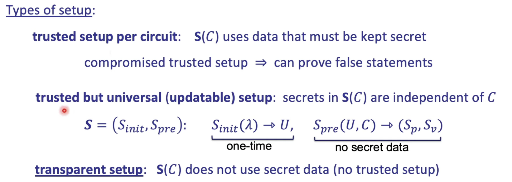

# Setup Process

Why we need to setup ?
    - cuz we need to know that proof is generate collectly from prover 


## This is type of setup 




but here in this section we gonna use ```goth16``` to process trust setup 
and it's trust setup per circuit.


here's a code example of trust setup process 

```rust


use ark_bn254::Bn254;
use ark_circom::CircomBuilder;
use ark_circom::CircomConfig;
use ark_groth16::Groth16;
use ark_snark::SNARK;

fn main() {

    let cfg = CircomConfig::<Bn254>::new("main.wasm", "main.r1cs").unwrap();

    let mut builder = CircomBuilder::new(cfg);
    builder.push_input("in", 7);

    // Create an empty instance for setting it up
    let circom = builder.setup();

    // this is random bit that use one time percircuit
    let mut rng = rand::thread_rng(); 👈
    let params =
        Groth16::<Bn254>::generate_random_parameters_with_reduction(circom, &mut rng).unwrap();


}

```