```mermaid
    graph LR
    A[x1] --> Plus(+)
    B[x2] --> Plus(+)
    Constant[1] --> Plus(+)
    Constant[1] --> minus(−)
    B[x2] --> minus
    Plus(+) --> Product(*)
    A[x1] --> Product(*)
    minus(−) --> Product(*)
    Product(*) --> Result(x1 *﹙x1 + x2 + 1﹚ * ﹙x2 − 1﹚)
```

# Component in ZK-SNARK

Here is a main component of ZK-SARK 


Let's explain one by one 
1. Circuit(C) = Arithmetic circuit
    - DAG (directed acyclic grahp)
    - Arithmetic circuit is an n-variate polinomial with an evaluation recipe
    - |c| = gate of circuit.
    - Writing in DHL language 👉 [Circom](https://ninnin-bigfoot.github.io/book/circom/circom.html)
    - Number in Arithmetic circuit will be mod with finite field 𝔽 👉 [ECDH](https://ninnin-bigfoot.github.io/book/math/math.html)

here's example of DAG (directed acyclic grahp) that explain this aritmeric circuit ```x1 * (x1 + x2 + 1) * ( x2 + 1)```

This circuit have 3 gate, and 
circuit will take input (x, w) to produce ```proof``` 

2. X = Public statement 
    - for example, I need to proof what a are ? in this circuit(arithmetic circuit) ```a**3 + a + 5 == 35```
    this equation is statement. 

3. W = Secret withness 
    - Thing that you gonna take to proof, such as you need to find what a are in  ```a**3 + a + 5 == 35``` if you put ***3*** this is you secret withness
> Relation of (X, W) for more example 👉 ***"W is the credential for account X"***, ***"W is secret key for public key X"*** etc.
4. S(Setup algorithm)  = Preprocessing
    - Why need setup 👉 [Setup explain](https://ninnin-bigfoot.github.io/book/math/math.html) ? 
        - Setup is kind of summarize all the things for prover and verifier 
        - Setup process will produce (Sp, Sv) for ***prover*** and ***verifier***

5. Prover 
    - job of prover is tyr to convince verifier that some value of W is valid. 
    - Prover will take (Sp, X, W) as input.

6. Verifier 
    - Verify poof from prover and give response (0, 1) reject or accept.