# Component in ZK-SNARK

Here are the main components of a ZK-SNARK.


Let's explain each component one by one.
1. Circuit(C) = Arithmetic circuit
    - DAG (directed acyclic grahp)
    - An arithmetic circuit can be represented as an n-variate polynomial with an associated evaluation recipe.
    - |c| = gate of the circuit.
    - Writing in DHL language 👉 [Circom](https://ninnin-bigfoot.github.io/book/circom/circom.html)
    - Number in Arithmetic circuit will be mod with finite field 𝔽 👉 [ECDH](https://ninnin-bigfoot.github.io/book/math/math.html)

Here is an example of a DAG (Directed Acyclic Graph) that illustrates this arithmetic circuit ```x1 * (x1 + x2 + 1) * ( x2 + 1)```

```mermaid
    graph LR
    A[x1] --> Plus(+)
    B[x2] --> Plus(+)
    Constant[1] --> Plus(+)
    Constant[1] --> minus(−)
    B[x2] --> minus
    Plus(+) --> Product(*)
    A[x1] --> Product(*)
    minus(−) --> Product(*)
    Product(*) --> Result(x1 *﹙x1 + x2 + 1﹚ * ﹙x2 − 1﹚)
```

This circuit has three gates, and it will take inputs (x, w) to produce a ```proof``` 

2. X = Public statement 
    - For example, I need to prove what 'a' is in this circuit (arithmetic circuit) ```a**3 + a + 5 == 35```
    This equation represents the statement.

3. W = Secret withness 
    - The thing you use to prove the statement is called the witness. For example, if you need to find the value of 'a' in the equation  ```a**3 + a + 5 == 35``` and the value of 'a' is 3, then '3' is your secret witness.
> Relation of (X, W) for more example 👉 ***"W is the credential for account X"***, ***"W is secret key for public key X"*** etc.
4. S(Setup algorithm)  = Preprocessing
    - Why is setup needed? You can find a detailed explanation of the setup process here 👉 [Setup explain](https://ninnin-bigfoot.github.io/book/math/math.html) ? 
        - In essence, the setup acts as a pre-processing step that generates common parameters (summarize) for both the prover and verifier.
        - The setup process outputs two sets of parameters: (Sp) for the ***prover*** and (Sv) for the ***verifier***.

5. Prover 
    - The prover's job is to convince the verifier that a specific value of W is valid.
    - The prover takes (Sp, X, W) as input.

6. Verifier 
    - The verifier receives a proof from the prover and determines whether to accept or reject it by returning a value of 0 (reject) or 1 (accept).