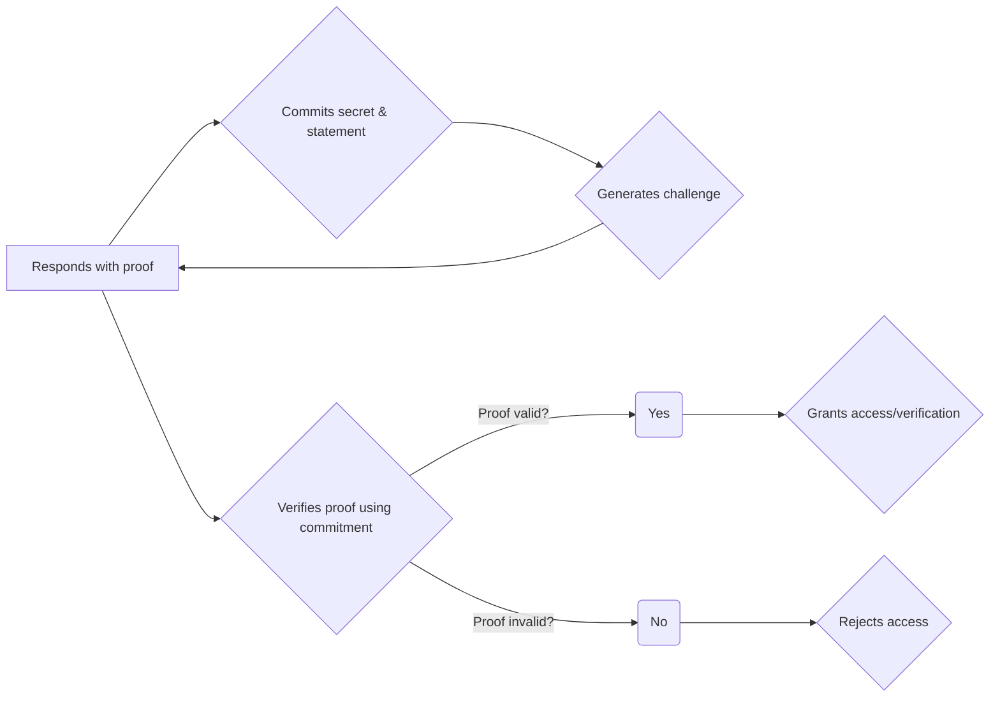

# ZK-SNARK

ZK Thecnology is using for proving the things by do not reveal any infomation or in the other word system will learn nothing about infomation.

But in this book we gonnna learn call ```ZK-SNARK```

let slipt a word ```SNARK``` <br> 
**S** = Succint <br>
**N** = Non-interactive <br>
**ARK** = Argement of Knowleage<br>

it's quit seem confustion ? but don't worry I'll explain step by step

 
***S (Succint)*** 👉  proof must be short and fasty to verify. <br><br>
***N (Non-interactive)*** 👉 Prover send proof to verifier in one way, that mean verifier will not response back to prover, just Accept or Reject.
<br><br>
***AR (Argement of Knowleage)*** 👉 Prover try to convince verifier to process proof without revel not thing about secret withness.

and all the thing that I've explain is working on a hole of this diagram we will use this diagram to explain how zk work in this book.

Here is a simple flow chart


OK now you will seen a briefly actor or component, in zk-snark 
next we will drive into each actor in zk-snark let go!!

