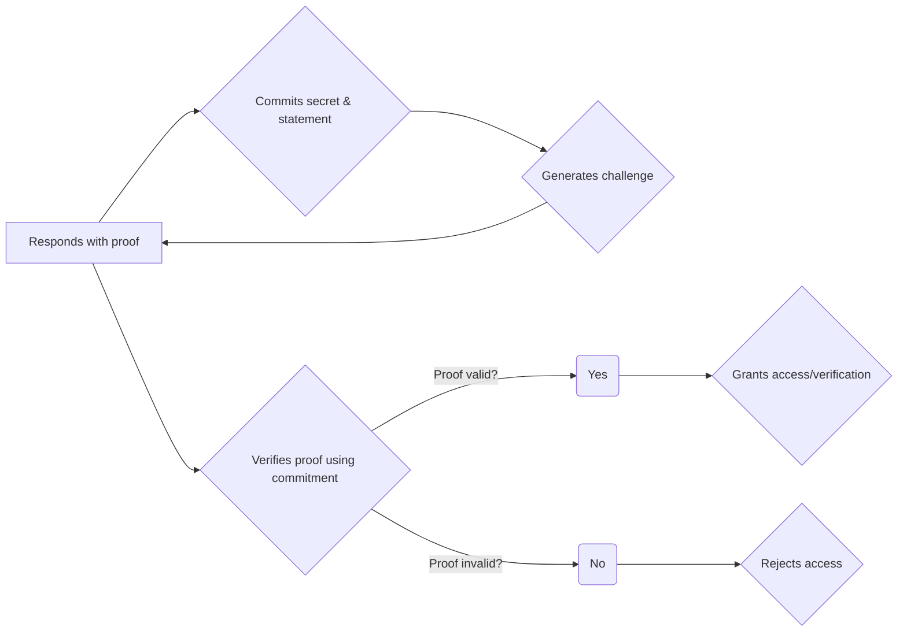

# ZK-SNARK

ZK technology is used for proving things without revealing any information. In other words, the system learns nothing about the information.

But in this book what we gonna learn is call```ZK-SNARK```

Let's split the word ```SNARK``` <br> 
**S** = Succint <br>
**N** = Non-interactive <br>
**ARK** = Argement of Knowleage<br>

it's quit seem confustion? but don't worry I'll explain step by step

 
***S (Succint)*** 👉  Proofs must be short and fast to verify. <br><br>
***N (Non-interactive)*** 👉 The prover sends a proof to the verifier in a one-way communication; therefore, the verifier does not respond to the prover, but only ***Accepts*** or ***Rejects*** it.
<br><br>
***AR (Argement of Knowleage)*** 👉 The prover tries to convince the verifier to process the proof without revealing anything about the secret witness.

Everything I have explained thus far pertains to this diagram, which we will use throughout this book to explain how ZK works.

Here is a simple flowchart to illustrate the process.


Now you will see a brief overview of the actors or components in zk-SNARK. Next, we will delve into each actor in detail. Let's begin!
